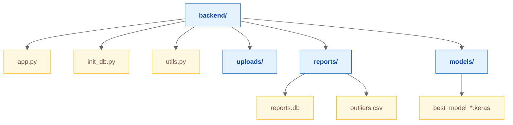
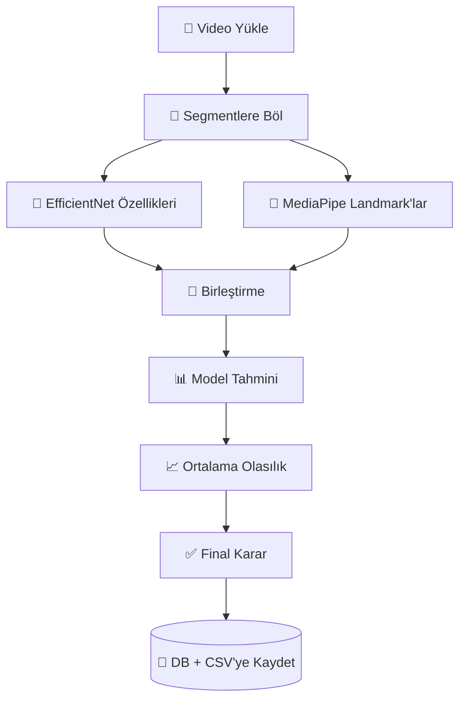

"# Backend" 
# 🧩 Otizm Erken Teşhis Farkındalık Projesi – Backend

Bu klasör, **otizm spektrum bozukluğu erken teşhis** projesinin **sunucu (backend)** kısmını içerir.  
Flask tabanlı bu API, kullanıcılardan gelen **video kayıtlarını işler**, derin öğrenme modeliyle tahmin yürütür ve sonuçları **SQLite veritabanına** kaydeder.

---

## ⚙️ Genel Mimari

---

## 🧠 Model Mimarisi

Model, `EfficientNetB0` tabanlı bir özellik çıkarıcı kullanır.  
Bu temel modelin çıktıları, davranışsal özelliklerle (`el, baş, göz hareketleri`) birleştirilir.  
Sonuçta elde edilen öznitelikler, özel olarak eğitilmiş bir sinir ağına gönderilir.

**Girdi:** Kullanıcı videosundan çıkarılan segmentler (görsel + landmark verisi)  
**Çıktı:**  
- `Otizm olabilir`  
- `Otizm değil`

---

## 🧾 Ana Bileşenler

### 📂 `app.py`

Flask uygulamasının çekirdek dosyasıdır.  
Aşağıdaki endpoint’leri sağlar:

| Endpoint | Metot | Açıklama |
|-----------|--------|-----------|
| `/upload` | `POST` | Kullanıcının gönderdiği video dosyasını alır, tahmin yürütür ve sonucu kaydeder. |
| `/admin_login` | `GET` | Yetkili giriş sayfasını döner. |
| `/admin` | `GET` | Veritabanındaki tüm kayıtları listeler (admin paneli). |
| `/index` | `GET` | Kullanıcı giriş sayfası. |
| `/record` | `POST` | Oyun ekranı render edilir (isim-soyisim parametreleriyle). |
| `/finish` | `GET` | Test tamamlandı ekranı. |

**Tahmin Süreci:**
1. Video `uploads/` klasörüne kaydedilir.  
2. `predict_video_with_segments()` çağrılır.  
3. Her segment için olasılıklar hesaplanır.  
4. Ortalama olasılığa göre final karar (`Otizm olabilir` veya `Otizm değil`) verilir.  
5. Sonuçlar hem:
   - `reports/reports.db` veritabanına,  
   - `reports/outliers.csv` dosyasına  
   kaydedilir.

---

### 🧱 `init_db.py`
Bu dosya, SQLite veritabanını oluşturur.  
Tablo yapısı aşağıdaki gibidir:

| Alan | Tür | Açıklama |
|------|-----|-----------|
| id | INTEGER | Otomatik artan kayıt ID |
| isim | TEXT | Kullanıcı adı |
| soyisim | TEXT | Kullanıcı soyadı |
| dosya | TEXT | Video dosya adı |
| probability | REAL | Ortalama olasılık |
| final_prediction | TEXT | Nihai sınıf etiketi |
| armflapping | INTEGER | El hareketi var mı (0/1) |
| headbanging | INTEGER | Baş hareketi var mı (0/1) |
| spinning | INTEGER | Dönen hareket var mı (0/1) |
| blink | INTEGER | Göz kırpma tespit edildi mi |
| created_at | TIMESTAMP | Otomatik zaman damgası |

---

### 🔍 `utils.py`
Video analizi ve öznitelik çıkarımı buradadır.

#### 📌 Ana fonksiyonlar

| Fonksiyon | Açıklama |
|------------|-----------|
| `extract_landmark_features(video_path)` | MediaPipe kullanarak el, baş, göz hareketlerini çıkarır. |
| `extract_features_segments(video_path, base_model)` | Videoyu parçalara ayırarak EfficientNet özelliklerini çıkarır. |
| `predict_video_with_segments(video_path, model, base_model)` | Segmentleri işler, ortalama olasılığı hesaplar, “outlier” segmentleri tespit eder. |

#### 🧩 Kullanılan teknolojiler
- **TensorFlow / Keras** – model yükleme ve tahmin  
- **OpenCV** – video okuma ve kare işleme  
- **MediaPipe** – yüz, el ve poz tespiti  
- **NumPy** – öznitelik hesaplama  
- **SQLite3 / CSV** – veri saklama  

---

## 📊 Raporlama Mekanizması

1. **Veritabanı (`reports.db`)**  
   - Her video için özet kayıt tutulur.  
   - Ortalama olasılık ve final karar içerir.  

2. **CSV Raporu (`outliers.csv`)**  
   - Her segmentin başlangıç-bitiş süresi, olasılığı, landmark özellikleri tutulur.  
   - Özellikle modelin güvenmediği (ortalamanın dışında kalan) segmentler incelenebilir.

---
## 🧮 Tahmin Akışı (Basitleştirilmiş Şema)

## 🧰 Yapılandırma Değişkenleri

| Değişken | Dosya | Açıklama |
|-----------|--------|----------|
| `UPLOAD_FOLDER` | `app.py` | Gelen videoların saklandığı klasör |
| `DB_FILE` | `app.py` | SQLite veritabanı yolu |
| `SAPMA_FILE` | `app.py` | Segment detaylarının CSV çıktısı |
| `MODEL_PATH` | `app.py` | Kullanılan Keras modelinin yolu |
| `THRESHOLD` | `app.py` | Model karar eşiği (olasılık) |

## 🔐 Admin Paneli

Admin paneline `/admin_login` sayfasından giriş yapılır.  
Giriş sonrası `/admin` sayfası üzerinden kayıtlar listelenir.

Her kayıt aşağıdaki sütunlarla görüntülenir:

- 👤 **Kullanıcı bilgisi**  
- 🎞️ **Video dosya adı**  
- 📊 **Model olasılığı**  
- 🧩 **Tespit edilen hareketler**

